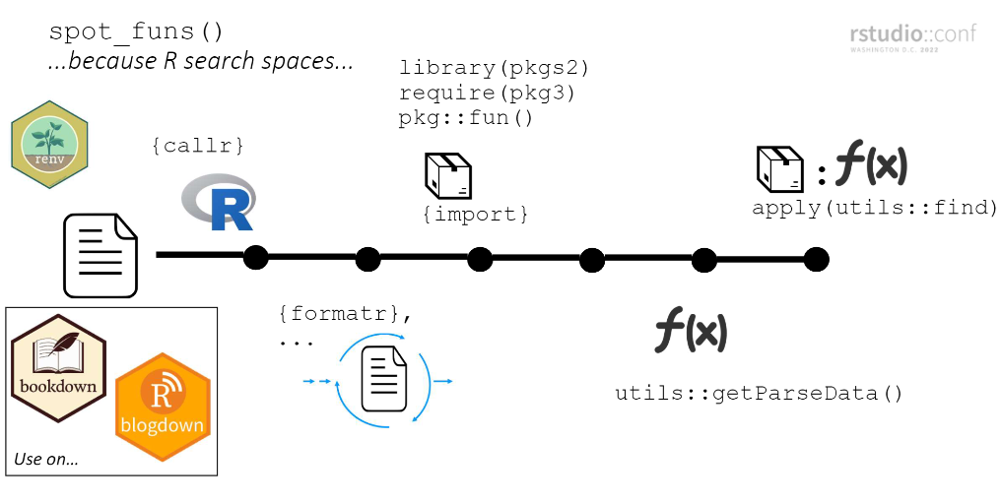

<!-- README.md is generated from README.Rmd. Please edit that file -->

```{r, include = FALSE}
knitr::opts_chunk$set(
  collapse = TRUE,
  comment = "#>",
  fig.path = "man/figures/README-",
  out.width = "100%",
  warning = FALSE,
  message = FALSE
)
```

<!-- badges: start -->
<!-- badges: end -->

The goal of funspotr (R function spotter) is to make it easy to identify which R functions and packages are used in files and projects. It was initially written to create reference tables of the functions and packages used in a few popular github repositories[^prior-posts].

There are roughly three types of functions in funspotr:

* `list_files_*()`: that identify files in a repository or related location
* `spot_*()`: that identify functions or packages in files
* other helpers that manipulate or plot outputs from the above functions

[^prior-posts]: The following posts were written using the initial API for funspotr -- the key functions used in these posts have now been deprecated:  
    - [Identifying R Functions & Packages Used in GitHub Repos (funspotr part 1)](https://www.bryanshalloway.com/2022/01/18/identifying-r-functions-packages-used-in-github-repos/) 
    - [Identifying R Functions & Packages in Github Gists (funspotr part 2)](https://www.bryanshalloway.com/2022/02/07/identifying-r-functions-packages-in-your-github-gists/)
    - [Network Plots of Code Collections (funspotr part 3)](https://www.bryanshalloway.com/2022/03/17/network-plots-of-code-collections-funspotr-part-3/)

funspotr is set-up for parsing R, Rmarkdown or Quarto files. If you want to parse a Jupyter notebook you should first [convert it](https://www.rdocumentation.org/packages/rmarkdown/versions/2.6/topics/convert_ipynb) to an appropriate file type. If you pass in a file type that is not recognized (e.g. a .txt file) funspotr will attempt to parse it as if it is a .R script.

funspotr is primarily designed for identifying the functions / packages in self-contained files or collections of self-contained files (e.g. a [blogdown](https://github.com/rstudio/blogdown) project^[Rather than, for example, [targets](https://github.com/ropensci/targets) workflows. Also, in some cases funspotr may not identify *every* function and/or package in a file (see [Limitations, problems, musings]) or read the source code for details).]). Though see [Package dependencies in another file] for examples of using it in other contexts.

## Installation

Install the latest stable version of funspotr from [CRAN](https://cran.r-project.org/) with:

```r
install.packages("funspotr")
```

You can install the development version of funspotr from [GitHub](https://github.com/) with:

``` r
# install.packages("devtools")
devtools::install_github("brshallo/funspotr")
```

## Talks and posts

- [slides](https://github.com/brshallo/funspotr-rstudioconf2022) and [presentation](https://www.youtube.com/watch?v=c9oU7ALJS3o) from Rstudio Conf 2022 *From summarizing projects to setting tags, uses of parsing R files*
- Part 1 of 3 from a series on [Identifying R functions and packages...](https://www.bryanshalloway.com/2022/01/18/identifying-r-functions-packages-used-in-github-repos/) 

## Examples of funspotr built reference tables

funspotr can be used to create reference tables of the functions and packages used in R projects.

- [Julia Silge blog](https://www.bryanshalloway.com/2022/01/18/identifying-r-functions-packages-used-in-github-repos/#julia-silge-blog)
- [David Robinson screencasts](https://www.bryanshalloway.com/2022/01/18/identifying-r-functions-packages-used-in-github-repos/#david-robinson-tidy-tuesday)
- [R for Data Science book](https://www.bryanshalloway.com/2022/01/18/identifying-r-functions-packages-used-in-github-repos/#r-for-data-science-chapters)
- [Bryan Shalloway blog](https://www.bryanshalloway.com/2022/01/18/identifying-r-functions-packages-used-in-github-repos/#bryan-shalloway-blog)
- [brshallo gists](https://www.bryanshalloway.com/2022/02/07/identifying-r-functions-packages-in-your-github-gists/#binding-files-together)

## Spot functions in a file

The primary function in funspotr is `spot_funs()` which returns a dataframe showing the functions and associated packages used in a file.

```{r}
library(funspotr)

file_lines <- "
library(dplyr)
require(tidyr)

as_tibble(mpg) %>% 
  mutate(class = as.character(class)) %>%
  group_by(class) %>%
  nest() %>%
  mutate(stats = purrr::map(data,
                            ~lm(cty ~ hwy, data = .x)))
 
made_up_fun()
"

file_output <- tempfile(fileext = ".R")
writeLines(file_lines, file_output)

spot_funs(file_path = file_output)
```

* `funs`: functions in file
* `pkgs`: best guess as to the package the functions came from  
* ...^[`in_multiple_pkgs`: (by default is dropped, pass in `keep_in_multiple_pkgs = TRUE` to `...` to display)Whether the function has multiple packages/environments on it's (guessed) search space. By default only the package at the top of the search space is returned. E.g. `as_tibble()` is attributed to [tidyr](https://tidyr.tidyverse.org/) by `spot_funs()` however `as_tibble()` is also in [dplyr](https://dplyr.tidyverse.org/). I don't worry about getting to the root source of the package or the fact that both of those packages are just reexporting it from [tibble](https://tibble.tidyverse.org/). Setting `keep_search_list = TRUE` will return rows for each item in the search list which may be helpful if getting unexpected results.)] 

<!-- The example below uses `spot_pkgs_from_DESCRIPTION()` to load in package dependencies and then passes the resulting character vector to `spot_funs_custom()`. -->

## Spot functions on all files in a project

funspotr has a few `list_files_*()` functions that return a dataframe of `relative_paths` and `absolute_paths` of all the R, Rmarkdown, or quarto files in a specified location (currently: github repo, gists, or local). These can be combined with a variant of `spot_funs()` that maps the function across each file path found, `spot_funs_files()`:

```{r}
library(dplyr)

# repo for an old presentation I gave
gh_ex <- list_files_github_repo(
  repo = "brshallo/feat-eng-lags-presentation", 
  branch = "main") %>% 
  spot_funs_files()

gh_ex
```

* `relative_paths` : relative filepath
* `absolute_paths`: absolute filepath (in this case URL to raw file on github)
* `spotted`: `purrr::safely()` style list-column of results^[list-column output where each item is a list containing `result` and `error`.] from mapping `spot_funs()` across `absolute_paths`. 

These results may then be unnested with the helper `funspotr::unnest_results()` to provide a table of functions and packages by filepath. This can be manipulated like any other dataframe -- say we want to filter to only those files where [here](https://here.r-lib.org/), [readr](https://readr.tidyverse.org/) or [rsample](https://rsample.tidymodels.org/) packages are used.

```{r}
gh_ex %>% 
  unnest_results() %>% 
  filter(pkgs %in% c("here", "readr", "rsample"))
```

The outputs from `funspotr::unnest_results()` can also be passed into `funspotr::network_plot()` to build a network visualization of the connections between functions/packages and files^[Took some inspiration from `plot()` method in [cranly](https://github.com/ikosmidis/cranly).].

### Previewing and customizing files to parse

You might only want to parse certain file types or a subset of the files in a repo.

```{r}
preview_files <- list_files_github_repo(
  repo = "brshallo/feat-eng-lags-presentation", 
  branch = "main")

preview_files
```

Say we only want to parse the "types-of-splits.R" and "Rmd-to-R.R" files.

```{r}
preview_files %>% 
  filter(stringr::str_detect(relative_paths, "types-of-splits|Rmd-to-R")) %>% 
  spot_funs_files() %>% 
  unnest_results()
```

Note that if you have a lot of files in a repo you may need to set-up sleep periods or clone the repo locally *and then* parse the files from there so as to stay within the limits of github API hits.

## Other things

### Files you didn't write

Functions created in the file as well as functions from unavailable packages (or packages that don't exist) will output as `pkgs = "(unknown)"`. 

```{r}
file_lines_missing_pkgs <- "
library(dplyr)

as_tibble(mpg)

hello_world <- function() print('hello world')

madeuppkg::made_up_fun()

hello_world()
"

missing_pkgs_ex <- tempfile(fileext = ".R")
writeLines(file_lines_missing_pkgs, missing_pkgs_ex)

spot_funs(file_path = missing_pkgs_ex)
```

*To spot which package a function is from you must have the package installed locally.* Hence for files on others' github repos or that you created on a different machine, it is a good idea to start with `funspotr::check_pkgs_availability()` to see which packages you are missing and install the missing packages locally. If you don't want to edit your global library you may want to use [renv](https://rstudio.github.io/renv/) or other environment management tools.

funspotr has an internal helper `funspotr::install_missing_pkgs()` for installing missing packages (see source "R/spot-pkgs.R" for documentation on use):

```r
spot_pkgs(file_output) %>%
  check_pkgs_availability() %>%
  funspotr::install_missing_pkgs()
```

Alternatively, you may want to clone the repository locally and then use `renv::dependencies()` and only then start using funspotr^[[renv](https://rstudio.github.io/renv/) is a more robust approach to finding and installing dependencies -- particularly in cases where you are missing many dependencies or don't want to alter the packages in your global library.]. 

### Package dependencies in another file

`spot_funs()` is currently set-up for self-contained files. But `spot_funs_custom()` allows the user to explicitly specify `pkgs` where functions may come from. This is useful in cases where the packages loaded are not in the same location as the `file_path` (e.g. they are loaded via `source()` or a DESCRIPTION file, or some other workflow). For example, below is a made-up example where the `library()` calls are made in a separate file and `source()`d in.

```{r}
# file where packages are loaded
file_libs <- "library(dplyr)
library(lubridate)"

file_libs_output <- tempfile(fileext = ".R")
writeLines(file_libs, file_libs_output)

# File of interest where things happen
file_run <- glue::glue(
"source('{ file_libs_output }')
  
tibble::tibble(days_from_today = 0:10) %>% 
    mutate(date = today() + days(days_from_today))
", 
file_libs_output = stringr::str_replace_all(file_libs_output, "\\\\", "/")
)

file_run_output <- tempfile(fileext = ".R")
writeLines(file_run, file_run_output)

# Identify packages using both files and then pass in explicitly to `spot_funs_custom()`
pkgs <- c(spot_pkgs(file_libs_output), 
          spot_pkgs(file_run_output, show_explicit_funs = TRUE))

spot_funs_custom(
  pkgs = pkgs,
  file_path = file_run_output)
```

Also see `funspotr::spot_pkgs_from_description()`.

### Show all function calls

Passing in `show_each_use = TRUE` to `...` in `spot_funs()` or `spot_funs_files()` will return *all* instances of a function call rather than just once for each file. 

Compared to the initial example, `mutate()` now shows-up at both rows 4 and 8:
```{r}
spot_funs(file_path = file_output, show_each_use = TRUE)
```

### Helper for [blogdown](https://pkgs.rstudio.com/blogdown/) tags

Setting `as_yaml_tags = TRUE` in `spot_pkgs()` flattens the dependencies and outputs them in a format that can be copied and pasted into the **tags** section of a blogdown post's YAML header.

```{r}
# Example from old blogdown post
spot_pkgs(
  file_path = "https://raw.githubusercontent.com/brshallo/brshallo/master/content/post/2020-02-06-maximizing-magnetic-volume-the-perfect-bowl.Rmd",
  as_yaml_tags = TRUE) %>% 
  cat()
```

`spot_pkgs_used()` will only return those packages that have functions actually used^[E.g. for cases when there are library calls that aren't actually used in the file. This may be useful in cases when metapackages like tidyverse or tidymodels are loaded but not all packages are actually used.].

*To automatically have your packages used as the tags for a post* you can add the function `funspotr::spot_tags()` to a bullet in the `tags` argument of your YAML header^[See ([blogdown#647](https://github.com/rstudio/blogdown/issues/647#issuecomment-1041599327), [blogdown#693](https://github.com/rstudio/blogdown/issues/693)) for an explanation of how `funspotr::spot_tags()` works.]. For example:

```{r echo = FALSE, comment = ""}
cat(htmltools::includeText("inst/ex-rmd-tags.Rmd"))
```

### Unexported functions

Many of the unexported functions in funspotr may be helpful in building up other workflows for mapping `spot_funs()` across multiple files^[Most unexported functions in `funspotr` still include a man file and at least partial documentation.] *If you have a suggestion for a function, feel free to open an issue.* 

<!-- **If you've used {funspotr} to map the R functions and packages of a public blog or repository, open an issue to add a link in the README.** -->

## How `spot_funs()` works

funspotr mimics the search space of each file prior to identifying `pkgs`/`funs`. At a high-level...

1. Create a new R instance using [callr](https://github.com/r-lib/callr) and clean-up the specified file using [formatR](https://github.com/yihui/formatR)
2. Load packages. Explicit calls (e.g. `pkg::fun()`) are loaded individually via [import](https://github.com/rticulate/import) and are loaded last (putting them at the top of the search space)^[This heuristic is imperfect and means that a file with "library(dplyr); select(); MASS::select()" would view both `select()` calls as coming from {MASS} -- when what it should do is view the first was as coming from {dplyr} and the second from {MASS}.].

(steps 1 and 2 needed so that step 4 has the best chance of identifying the package a function comes from in the file.)

3. Pass file through `utils::getParseData()` and filter to just functions^[inspired by `NCmisc::list.functions.in.file()`.]
4. Pass functions through `utils::find()` to identify associated package

*Explainer slide from Rstudio Conf 2022 [presentation](https://www.youtube.com/watch?v=c9oU7ALJS3o):*



## Limitations, problems, musings

* funspotr is specific to R. If you try and pass in a file from a different language you will get a parsing error or the code commented out^[For example... If you pass in a .Rmd or .qmd that has a mix of R and python code chunks, the python chunks will simply be commented out. If you pass in a python script, you will almost certainly get a parsing error for that file.]. The steps taken by funspotr would also not be needed in many other programming languages^[In a language like python, where calls are more explicit (e.g. `np.*`), all of the stuff with recreating the search space would likely be unnecessary and you could more easily just identify packages/functions by parsing the text (which would run faster).].
* funspotr does not work perfectly at identifying functions or packages. One common example example is it will not identify functions passed as arguments. For example it will not identify `mean` in this example: `lapply(x, mean)` . Similarly it will not identify functions within `switch()`. See [#13](https://github.com/brshallo/funspotr/issues/13).
* If a file contains R syntax that is not well defined it will not be parsed and will return an error. See [formatR#further-notes](https://yihui.org/formatr/#6-further-notes) (used by {funspotr} in parsing) for other common reasons for failure.
* `knitr::read_chunk()` and `knitr::purl()` in a file passed to {funspotr} will also frequently cause an error in parsing. See [knitr#1753](https://github.com/yihui/knitr/issues/1753) & [knitr#1938](https://github.com/yihui/knitr/issues/1938)
* Please open an issue if you find other cases where parsing breaks :-) .
* As mentioned elsewhere, the default parsing of `spot_funs()` is primarily for cases where package dependencies are loaded in the same file that they are used in^[i.e. in interactive R scripts or Rmd or qmd documents where you use `library()` or related calls within the script.]. Scripts that are not self-contained typically should have the `pkgs` argument provided explicitly via `spot_funs_custom()`.
* funspotr does not pay attention to when functions are reexported from elsewhere. For example, many tibble functions are reexported by dplyr and tidyr -- funspotr though will not know the "true" home of these functions it is simply looking at the top of the search space^[For example when reviewing David Robinson's Tidy Tuesday code I found that the [meme](https://github.com/GuangchuangYu/meme) package was used far more than I would have expected. Turns out it was just due to it reexporting the `aes()` function from ggplot.].
* Feel free to open an issue if you'd be interested in a simplifying function or vignette for mapping `spot_funs()` through other folder structures not yet mentioned.
* All the functions in "R/spot-pkgs.R" would probably be better handled by something like `renv::dependencies()` or a parsing based approach. The simple regex's I use have a variety of problems. As just one example `funspotr::get_pkgs()` will not recognize when a package is within quotes or being escaped^[e.g. in this case `lines <- "library(pkg)"`  the `pkg` would show-up as a dependency despite just being part of a quote rather than actually loaded.]. See [#14](https://github.com/brshallo/funspotr/issues/14)
* There may be something to be learned from how `R CMD check` does function parsing. 
    * funspotr's current approach is slow and uses imperfect heuristics
* Does not identify infix operators, e.g. `+`^[maybe that's fine though.]
* funspotr has lots of dependencies. It may have make sense to move some of the non-core functionality into a separate package (e.g. stuff concerning `list_files*()`)
* Rather than running `list_files_github_repo()` it may make sense to instead clone the repo locally and then run `list_files_wd()` from the repo prior to running `spot_funs_files()` as this will limit the number of API hits to github.
* Currently it's possible to have github block you pretty soon due to hitting too many files (in which case you'll likely get a 403 or connection error). There are some things that could be done to reduce number of github API hits (e.g. above bullet, `Sys.sleep()`, ...).
* Throughout the code and package documentation I have "inspiration" bullets followed by a link pointing to places where I took stuff from stack overflow, github, or other packages. Also see the footnotes of the README.

