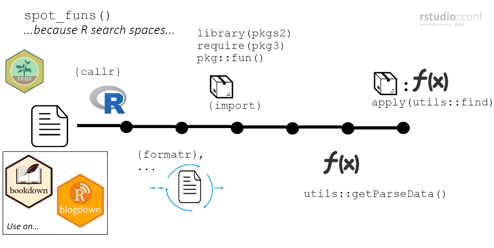

# funspotr <a href="https://brshallo.github.io/funspotr/"></a>

[](https://lifecycle.r-lib.org/articles/stages.html#experimental)
[](https://github.com/brshallo/funspotr/actions)
[](https://CRAN.R-project.org/package=funspotr)

- [Installation](#installation)
- [Talks and posts](#talks-and-posts)
- [Examples of funspotr built reference
  tables](#examples-of-funspotr-built-reference-tables)
- [Spot functions in a file](#spot-functions-in-a-file)
- [Spot functions on all files in a
  project](#spot-functions-on-all-files-in-a-project)
  - [Previewing and customizing files to
    parse](#previewing-and-customizing-files-to-parse)
- [Other things](#other-things)
  - [Files you didn’t write](#files-you-didnt-write)
  - [Package dependencies in another
    file](#package-dependencies-in-another-file)
  - [Show all function calls](#show-all-function-calls)
  - [Helper for blog tags](#helper-for-blog-tags)
- [How `spot_funs()` works](#how-spot_funs-works)
- [Limitations, problems, musings](#limitations-problems-musings)

<!-- README.md is generated from README.Rmd. Please edit that file -->
<!-- badges: start -->
<!-- Actually go to inst/header.md to add badges -->
<!-- badges: end -->

The goal of funspotr (R function spotter) is to make it easy to identify
which R functions and packages are used in files and projects. It was
initially written to create reference tables of the functions and
packages used in a few popular github repositories[^1].

There are roughly three types of functions in funspotr:

- `list_files_*()`: that identify files in a repository or related
  location
- `spot_*()`: that identify functions or packages in files
- other helpers that manipulate or plot outputs from the above functions

funspotr is set-up for parsing R, Rmarkdown or Quarto files. If you want
to parse a Jupyter notebook you should first [convert
it](https://www.rdocumentation.org/packages/rmarkdown/versions/2.6/topics/convert_ipynb)
to an appropriate file type. If you pass in a file type that is not
recognized (e.g. a .txt file) funspotr will attempt to parse it as if it
is a .R script.

funspotr is primarily designed for identifying the functions / packages
in self-contained files or collections of self-contained files (e.g. a
[blogdown](https://github.com/rstudio/blogdown) project[^2]). Though see
[Package dependencies in another
file](#package-dependencies-in-another-file) for examples of using it in
other contexts.

## Installation

Install the latest stable version of funspotr from
[CRAN](https://cran.r-project.org/) with:

``` r
install.packages("funspotr")
```

You can install the development version of funspotr from
[GitHub](https://github.com/) with:

``` r
# install.packages("devtools")
devtools::install_github("brshallo/funspotr")
```

## Talks and posts

- [slides](https://github.com/brshallo/funspotr-rstudioconf2022) and
  [presentation](https://www.youtube.com/watch?v=c9oU7ALJS3o) from
  Rstudio Conf 2022 *From summarizing projects to setting tags, uses of
  parsing R files*
- Part 1 of 3 from a series on [Identifying R functions and
  packages…](https://www.bryanshalloway.com/2022/01/18/identifying-r-functions-packages-used-in-github-repos/)

## Examples of funspotr built reference tables

funspotr can be used to create reference tables of the functions and
packages used in R projects.

- [Julia Silge
  blog](https://www.bryanshalloway.com/2022/01/18/identifying-r-functions-packages-used-in-github-repos/#julia-silge-blog)
- [David Robinson
  screencasts](https://www.bryanshalloway.com/2022/01/18/identifying-r-functions-packages-used-in-github-repos/#david-robinson-tidy-tuesday)
- [R for Data Science
  book](https://www.bryanshalloway.com/2022/01/18/identifying-r-functions-packages-used-in-github-repos/#r-for-data-science-chapters)
- [Bryan Shalloway
  blog](https://www.bryanshalloway.com/2022/01/18/identifying-r-functions-packages-used-in-github-repos/#bryan-shalloway-blog)
- [brshallo
  gists](https://www.bryanshalloway.com/2022/02/07/identifying-r-functions-packages-in-your-github-gists/#binding-files-together)

## Spot functions in a file

The primary function in funspotr is `spot_funs()` which returns a
dataframe showing the functions and associated packages used in a file.

``` r
library(funspotr)

file_lines <- "
library(dplyr)
require(tidyr)

as_tibble(mpg) %>% 
  mutate(class = as.character(class)) %>%
  group_by(class) %>%
  nest() %>%
  mutate(stats = purrr::map(data,
                            ~lm(cty ~ hwy, data = .x)))
 
made_up_fun()
"

file_output <- tempfile(fileext = ".R")
writeLines(file_lines, file_output)

spot_funs(file_path = file_output)
#> # A tibble: 10 × 2
#>    funs         pkgs     
#>    <chr>        <chr>    
#>  1 library      base     
#>  2 require      base     
#>  3 as_tibble    tidyr    
#>  4 mutate       dplyr    
#>  5 as.character base     
#>  6 group_by     dplyr    
#>  7 nest         tidyr    
#>  8 map          purrr    
#>  9 lm           stats    
#> 10 made_up_fun  (unknown)
```

- `funs`: functions in file
- `pkgs`: best guess as to the package the functions came from  
- …[^3]

## Spot functions on all files in a project

funspotr has a few `list_files_*()` functions that return a dataframe of
`relative_paths` and `absolute_paths` of all the R, Rmarkdown, or quarto
files in a specified location (currently: github repo, gists, or local).
These can be combined with a variant of `spot_funs()` that maps the
function across each file path found, `spot_funs_files()`:

``` r
library(dplyr)

# repo for an old presentation I gave
gh_ex <- list_files_github_repo(
  repo = "brshallo/feat-eng-lags-presentation", 
  branch = "main") %>% 
  spot_funs_files()

gh_ex
#> # A tibble: 4 × 3
#>   relative_paths                absolute_paths                      spotted     
#>   <chr>                         <chr>                               <list>      
#> 1 R/Rmd-to-R.R                  https://raw.githubusercontent.com/… <named list>
#> 2 R/feat-engineering-lags.R     https://raw.githubusercontent.com/… <named list>
#> 3 R/load-inspections-save-csv.R https://raw.githubusercontent.com/… <named list>
#> 4 R/types-of-splits.R           https://raw.githubusercontent.com/… <named list>
```

- `relative_paths` : relative filepath
- `absolute_paths`: absolute filepath (in this case URL to raw file on
  github)
- `spotted`: `purrr::safely()` style list-column of results[^4] from
  mapping `spot_funs()` across `absolute_paths`.

These results may then be unnested with the helper
`funspotr::unnest_results()` to provide a table of functions and
packages by filepath. This can be manipulated like any other dataframe –
say we want to filter to only those files where
[here](https://here.r-lib.org/), [readr](https://readr.tidyverse.org/)
or [rsample](https://rsample.tidymodels.org/) packages are used.

``` r
gh_ex %>% 
  unnest_results() %>% 
  filter(pkgs %in% c("here", "readr", "rsample"))
#> # A tibble: 8 × 4
#>   funs               pkgs    relative_paths                absolute_paths       
#>   <chr>              <chr>   <chr>                         <chr>                
#> 1 here               here    R/Rmd-to-R.R                  https://raw.githubus…
#> 2 read_csv           readr   R/feat-engineering-lags.R     https://raw.githubus…
#> 3 initial_time_split rsample R/feat-engineering-lags.R     https://raw.githubus…
#> 4 training           rsample R/feat-engineering-lags.R     https://raw.githubus…
#> 5 testing            rsample R/feat-engineering-lags.R     https://raw.githubus…
#> 6 sliding_period     rsample R/feat-engineering-lags.R     https://raw.githubus…
#> 7 write_csv          readr   R/load-inspections-save-csv.R https://raw.githubus…
#> 8 here               here    R/load-inspections-save-csv.R https://raw.githubus…
```

The outputs from `funspotr::unnest_results()` can also be passed into
`funspotr::network_plot()` to build a network visualization of the
connections between functions/packages and files[^5].

### Previewing and customizing files to parse

You might only want to parse certain file types or a subset of the files
in a repo.

``` r
preview_files <- list_files_github_repo(
  repo = "brshallo/feat-eng-lags-presentation", 
  branch = "main")

preview_files
#> # A tibble: 4 × 2
#>   relative_paths                absolute_paths                                  
#>   <chr>                         <chr>                                           
#> 1 R/Rmd-to-R.R                  https://raw.githubusercontent.com/brshallo/feat…
#> 2 R/feat-engineering-lags.R     https://raw.githubusercontent.com/brshallo/feat…
#> 3 R/load-inspections-save-csv.R https://raw.githubusercontent.com/brshallo/feat…
#> 4 R/types-of-splits.R           https://raw.githubusercontent.com/brshallo/feat…
```

Say we only want to parse the “types-of-splits.R” and “Rmd-to-R.R”
files.

``` r
preview_files %>% 
  filter(stringr::str_detect(relative_paths, "types-of-splits|Rmd-to-R")) %>% 
  spot_funs_files() %>% 
  unnest_results()
#> # A tibble: 24 × 4
#>    funs      pkgs      relative_paths      absolute_paths                       
#>    <chr>     <chr>     <chr>               <chr>                                
#>  1 purl      knitr     R/Rmd-to-R.R        https://raw.githubusercontent.com/br…
#>  2 here      here      R/Rmd-to-R.R        https://raw.githubusercontent.com/br…
#>  3 library   base      R/types-of-splits.R https://raw.githubusercontent.com/br…
#>  4 theme_set ggplot    R/types-of-splits.R https://raw.githubusercontent.com/br…
#>  5 theme_bw  ggplot    R/types-of-splits.R https://raw.githubusercontent.com/br…
#>  6 set.seed  base      R/types-of-splits.R https://raw.githubusercontent.com/br…
#>  7 tibble    dplyr     R/types-of-splits.R https://raw.githubusercontent.com/br…
#>  8 rep       base      R/types-of-splits.R https://raw.githubusercontent.com/br…
#>  9 today     lubridate R/types-of-splits.R https://raw.githubusercontent.com/br…
#> 10 days      lubridate R/types-of-splits.R https://raw.githubusercontent.com/br…
#> # ℹ 14 more rows
```

Note that if you have a lot of files in a repo you may need to set-up
sleep periods or clone the repo locally *and then* parse the files from
there so as to stay within the limits of github API hits.

## Other things

### Files you didn’t write

Functions created in the file as well as functions from unavailable
packages (or packages that don’t exist) will output as
`pkgs = "(unknown)"`.

``` r
file_lines_missing_pkgs <- "
library(dplyr)

as_tibble(mpg)

hello_world <- function() print('hello world')

madeuppkg::made_up_fun()

hello_world()
"

missing_pkgs_ex <- tempfile(fileext = ".R")
writeLines(file_lines_missing_pkgs, missing_pkgs_ex)

spot_funs(file_path = missing_pkgs_ex)
#> # A tibble: 5 × 2
#>   funs        pkgs     
#>   <chr>       <chr>    
#> 1 library     base     
#> 2 as_tibble   dplyr    
#> 3 print       base     
#> 4 made_up_fun (unknown)
#> 5 hello_world (unknown)
```

*To spot which package a function is from you must have the package
installed locally.* Hence for files on others’ github repos or that you
created on a different machine, it is a good idea to start with
`funspotr::check_pkgs_availability()` to see which packages you are
missing and install the missing packages locally. If you don’t want to
edit your global library you may want to use
[renv](https://rstudio.github.io/renv/) or other environment management
tools.

funspotr has an internal helper `funspotr::install_missing_pkgs()` for
installing missing packages:

``` r
spot_pkgs(file_output) %>%
  check_pkgs_availability() %>%
  funspotr::install_missing_pkgs()
```

Alternatively, you may want to clone the repository locally and then use
`renv::dependencies()` and only then start using funspotr[^6].

### Package dependencies in another file

`spot_funs()` is currently set-up for self-contained files. But
`spot_funs_custom()` allows the user to explicitly specify `pkgs` where
functions may come from. This is useful in cases where the packages
loaded are not in the same location as the `file_path` (e.g. they are
loaded via `source()`, or a DESCRIPTION file, or some other workflow).
For example, below is a made-up example where the `library()` calls are
made in a separate file and `source()`’d in.

``` r
# file where packages are loaded
file_libs <- "library(dplyr)
library(lubridate)"

file_libs_output <- tempfile(fileext = ".R")
writeLines(file_libs, file_libs_output)

# File of interest where things happen
file_run <- glue::glue(
"source('{ file_libs_output }')
  
tibble::tibble(days_from_today = 0:10) %>% 
    mutate(date = today() + days(days_from_today))
", 
file_libs_output = stringr::str_replace_all(file_libs_output, "\\\\", "/")
)

file_run_output <- tempfile(fileext = ".R")
writeLines(file_run, file_run_output)

# Identify packages using both files and then pass in explicitly to `spot_funs_custom()`
pkgs <- c(spot_pkgs(file_libs_output), 
          spot_pkgs(file_run_output, show_explicit_funs = TRUE))

spot_funs_custom(
  pkgs = pkgs,
  file_path = file_run_output)
#> # A tibble: 5 × 2
#>   funs   pkgs     
#>   <chr>  <chr>    
#> 1 source base     
#> 2 tibble tibble   
#> 3 mutate dplyr    
#> 4 today  lubridate
#> 5 days   lubridate
```

Also see `funspotr::spot_pkgs_from_description()`.

### Show all function calls

Passing in `show_each_use = TRUE` to `...` in `spot_funs()` or
`spot_funs_files()` will return *all* instances of a function call
rather than just once for each file.

Compared to the initial example, `mutate()` now shows-up at both rows 4
and 8:

``` r
spot_funs(file_path = file_output, show_each_use = TRUE)
#> # A tibble: 11 × 2
#>    funs         pkgs     
#>    <chr>        <chr>    
#>  1 library      base     
#>  2 require      base     
#>  3 as_tibble    tidyr    
#>  4 mutate       dplyr    
#>  5 as.character base     
#>  6 group_by     dplyr    
#>  7 nest         tidyr    
#>  8 mutate       dplyr    
#>  9 map          purrr    
#> 10 lm           stats    
#> 11 made_up_fun  (unknown)
```

### Helper for blog tags

*To automatically have your packages used as the tags for a blog post*
you can add an inline function `funspotr::spot_tags()` to a bullet in
the `tags` or `categories` argument of your YAML header. For example:

    ---
    title: This is a post
    author: brshallo
    date: '2022-02-11'
    tags: ["`r funspotr::spot_tags()`"]
    slug: this-is-a-post
    ---

## How `spot_funs()` works

funspotr mimics the search space of each file prior to identifying
`pkgs`/`funs`. At a high-level…

1.  Create a new R instance using
    [callr](https://github.com/r-lib/callr) and clean-up the specified
    file using [formatR](https://github.com/yihui/formatR)
2.  Load packages. Explicit calls (e.g. `pkg::fun()`) are loaded
    individually via [import](https://github.com/rticulate/import) and
    are loaded last (putting them at the top of the search space)[^7].

(steps 1 and 2 needed so that step 4 has the best chance of identifying
the package a function comes from in the file.)

3.  Pass file through `utils::getParseData()` and filter to just
    functions
4.  Pass functions through `utils::find()` to identify associated
    package

*Explainer slide from Rstudio Conf 2022
[presentation](https://www.youtube.com/watch?v=c9oU7ALJS3o):*



## Limitations, problems, musings

- funspotr is specific to R. If you try and pass in a file from a
  different language you will get a parsing error or the code commented
  out[^8]. The steps taken by funspotr would also not be needed in many
  other programming languages[^9].
- funspotr does not work perfectly at identifying functions or packages.
  One common example is it will not identify functions passed as
  arguments. For example it will not identify `mean` in this example:
  `lapply(x, mean)` . Similarly it will not identify functions within
  `switch()`. See
  [\#13](https://github.com/brshallo/funspotr/issues/13).
- If a file contains R syntax that is not well defined it will not be
  parsed and will return an error. See
  [formatR#further-notes](https://yihui.org/formatr/#6-further-notes)
  (used by funspotr in parsing) for other common reasons for failure.
- `knitr::read_chunk()` and `knitr::purl()` in a file passed to funspotr
  will also frequently cause an error in parsing. See
  [knitr#1753](https://github.com/yihui/knitr/issues/1753) &
  [knitr#1938](https://github.com/yihui/knitr/issues/1938)
- Please open an issue if you find other cases where parsing breaks :-)
  .
- As mentioned elsewhere, the default parsing of `spot_funs()` is
  primarily for cases where package dependencies are loaded in the same
  file that they are used in[^10]. Scripts that are not self-contained
  typically should have the `pkgs` argument provided explicitly via
  `spot_funs_custom()`.
- funspotr does not pay attention to when functions are reexported from
  elsewhere. For example, many tibble functions are reexported by dplyr
  and tidyr – funspotr though will not know the “true” home of these
  functions it is simply looking at the top of the search space[^11].
- Feel free to open an issue if you’d be interested in a simplifying
  function or vignette for mapping `spot_funs()` through other folder
  structures not yet mentioned.
- All the functions in “R/spot-pkgs.R” would probably be better handled
  by something like `renv::dependencies()` or a parsing based approach.
  The simple regex’s I use have a variety of problems[^12].
  - There may be something to be learned from how `R CMD check` does
    function parsing. funspotr’s current approach is comparatively slow
    and uses imperfect heuristics.
- Does not identify infix operators, e.g. `+`
- funspotr has lots of dependencies. It may have make sense to move some
  of the non-core functionality into a separate package (e.g. stuff
  concerning `list_files*()`)
- Rather than running `list_files_github_repo()` it may make sense to
  instead clone the repo locally and then run `list_files_wd()` from the
  repo prior to running `spot_funs_files()` as this will limit the
  number of API hits to github.
- Currently it’s possible to have github block you pretty soon due to
  hitting too many files (in which case you’ll likely get a 403 or
  connection error). There are some things that could be done to reduce
  number of github API hits (e.g. above bullet, or using `Sys.sleep()`,
  …).
- Throughout the code and package documentation I have “inspiration”
  bullets followed by a link pointing to places where I took stuff from
  stack overflow, github, or other packages. Also see the footnotes of
  the README.

[^1]: Prior posts (some of which used a now deprecated API):  
    - [Identifying R Functions & Packages Used in GitHub Repos (funspotr
    part
    1)](https://www.bryanshalloway.com/2022/01/18/identifying-r-functions-packages-used-in-github-repos/)  
    - [Identifying R Functions & Packages in Github Gists (funspotr part
    2)](https://www.bryanshalloway.com/2022/02/07/identifying-r-functions-packages-in-your-github-gists/)  
    - [Network Plots of Code Collections (funspotr part
    3)](https://www.bryanshalloway.com/2022/03/17/network-plots-of-code-collections-funspotr-part-3/)

[^2]: Rather than, for example,
    [targets](https://github.com/ropensci/targets) workflows. Also, in
    some cases funspotr may not identify *every* function and/or package
    in a file (see [Limitations, problems,
    musings](#limitations-problems-musings) or read the source code for
    details).

[^3]: Other arguments may produce additional columns. See `spot_funs()`
    reference page for details.

[^4]: list-column output where each item is a list containing `result`
    and `error`.

[^5]: Took inspiration from `plot()` method in
    [cranly](https://github.com/ikosmidis/cranly).

[^6]: [renv](https://rstudio.github.io/renv/) is a more robust approach
    to finding and installing dependencies – particularly in cases where
    you are missing many dependencies or don’t want to alter the
    packages in your global library.

[^7]: This heuristic is imperfect and means that a file with
    “library(dplyr); select(); MASS::select()” would view both
    `select()` calls as coming from {MASS} – when what it should do is
    view the first was as coming from {dplyr} and the second from
    {MASS}.

[^8]: For example… If you pass in a .Rmd or .qmd that has a mix of R and
    python code chunks, the python chunks will simply be commented out.
    If you pass in a python script, you will almost certainly get a
    parsing error for that file.

[^9]: In a language like python, where calls are more explicit
    (e.g. `np.*`), all of the stuff with recreating the search space
    would likely be unnecessary and you could more easily just identify
    packages/functions by parsing the text.

[^10]: i.e. in interactive R scripts or Rmd or qmd documents where you
    use `library()` or related calls within the script.

[^11]: For example when reviewing David Robinson’s Tidy Tuesday code I
    found that the [meme](https://github.com/GuangchuangYu/meme) package
    was used far more than I would have expected. Turns out it was just
    due to it reexporting the `aes()` function from ggplot.

[^12]: e.g. in this case `lines <- "library(pkg)"` the `pkg` would
    show-up as a dependency despite just being part of a quote rather
    than actually loaded. See
    [\#14](https://github.com/brshallo/funspotr/issues/14) for
    disucssion of other approaches.
